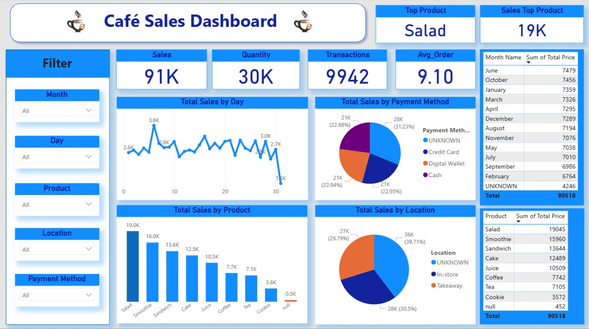

# ☕ Cafe Sales Dashboard 📊

## 1. 🎯 The Goal
The goal of this project was to create a clear and interactive Excel & Power BI dashboard to analyze the sales performance of a real cafe.  
The project focuses on understanding sales trends, customer behavior, and menu performance to support data-driven business decisions.  

The dashboard helps answer key questions such as:  

- Which menu items generate the most revenue?  
- What are the daily, weekly, and monthly sales trends?  
- How do payment methods and locations impact sales?  
- Are there patterns in customer behavior and peak hours?  
- Which items or categories need attention for optimization or promotion?  

---

## 2. ❓ The Problem
The cafe needed a way to better understand its operations and sales performance. Challenges included:  

**Data Issues:**  
- Some transactions had missing information such as payment method or location.  
- Occasional data entry mistakes affected prices or item names.  
- Ensuring date consistency for accurate trend analysis.  

The project aims to **clean, transform, and analyze** this sales data to provide actionable insights and improve decision-making.

---

## 3. 📊 The Dashboard
The dashboard includes multiple visuals to provide a comprehensive view of cafe sales:

**Included Visuals:**  
- **Revenue by Month** → Shows seasonality and demand patterns.  
- **Revenue by Product** → Highlights top-performing menu items.  
- **Revenue by Payment Method** → Understand customer payment preferences.  
- **Revenue by Location** → Compare performance across different locations.  
- **Top Selling Items and Categories** → Identify best-selling products.  
- **Customer Ordering Patterns by Hour** → Analyze peak ordering times.  

**KPIs:**  
- Total Revenue  
- Number of Transactions  
- Average Order Value  
- Most Popular Menu Items  

**Dashboard Screenshot**  

---

## 4. 🛠️ How I Built It

**Tools Used:**  
- Excel for:  
  - Data cleaning & transformation (handling missing values, correcting errors)  
  - Pivot Tables & Pivot Charts  
- Power BI for:  
  - Interactive dashboards  
  - Advanced visualizations  
  - Filtering & slicers for dynamic analysis  

**Data Cleaning Steps:**  
1. Handle Missing Values: Fill numeric columns with median/mean, categorical with mode or "Unknown".  
2. Correct Errors: Fix incorrect item names or prices.  
3. Ensure Date Consistency: Format all dates correctly and fill missing dates logically.  
4. Feature Engineering: Create new columns like Day of Week, Transaction Month for deeper analysis.

---

## 5. 💡 Key Insights
*Insights derived from the dashboard include:*  

- Best-selling menu items and categories  
- Peak sales hours and days  
- Location-wise revenue differences  
- Payment method trends  
- Opportunities for operational improvements  

---

## 6. 🚀 Recommendations
*Recommendations based on the dashboard insights:*  

- Adjust inventory for high-demand items  
- Optimize staffing for peak hours  
- Promote underperforming items or categories  
- Enhance customer experience based on location trends  

---

## 7. 📁 Files Included
- `Cafe_Sales.xlsx` — Main dataset  
- Excel & Power BI Dashboard file  
- `images/dashboard.jpg` — Dashboard screenshot  
- `README.md` — This file  

---

## 8. ✍️ About Me
**Mohamed Nasser**  
Data Analyst | BI Developer | Aspiring Data Scientist  

[LinkedIn](https://www.linkedin.com/in/mohamednasser)  
Email: *(ضع الإيميل لو تحب)*
